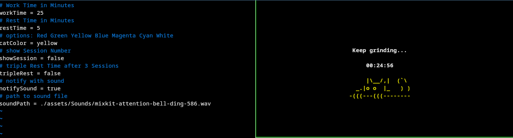
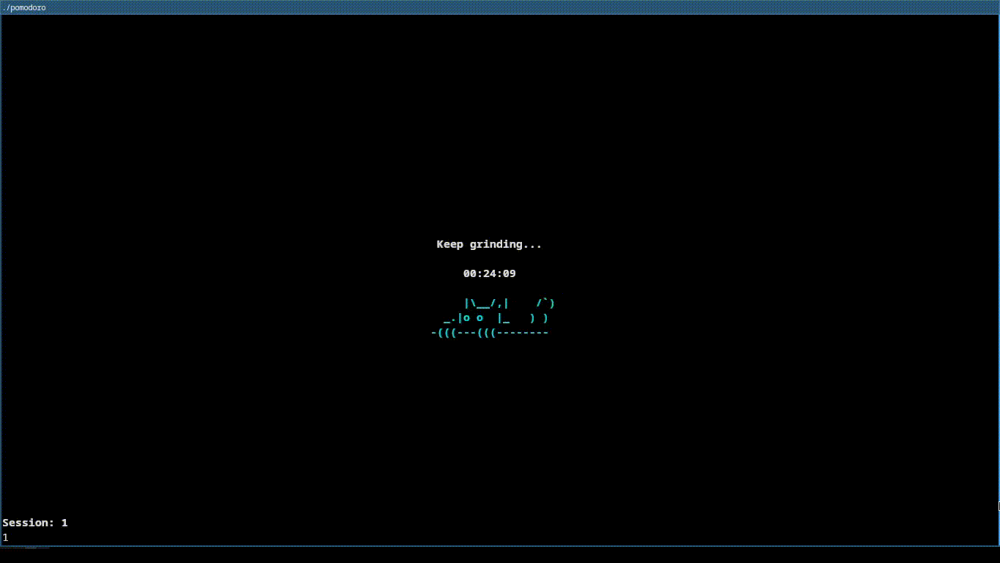

# pomoC: Your CLI Customizable Pomodoro Timer

## > Freatures:

 * **Configuration File:** now you can customize the default configuration of your POMOC using a config file.
 * **Makefile:** Build the executable with `make` and easily relocate the configuration file with a `CONFIG_PATH` variable.
 * **Command-Line Arguments:** Override default settings for work and rest time on the fly.
 * **Motivational Phrases:** each minute you'll get a new phrase to keep you going (you can change them in src/display.c).
 * **Session Counter:** Track your productivity with a visual indicator of completed sessions.
 * **Notification Sound:** Get audible notifications (using `aplay`) for work/rest transitions.
 * **Cat:** Bro we litteraly have a cat and you can color it, COLOR the cat, Cool I know.
## > Requirements:
  - C compiler (e.g., GCC).
  - aplay (if you want to get sound notification.). 
## > usage:
  - make the executable:
    ```
      $> make
    ```
  - run the executable:
     - run the default config:
    ```
      $> ./pomodoro
    ```
     - example run 25 minutes for work and 5 minutes rest:
    ```
      $> ./pomodoro 25 5
    ```
## > 
<p align="center">
 	
	
</p>

