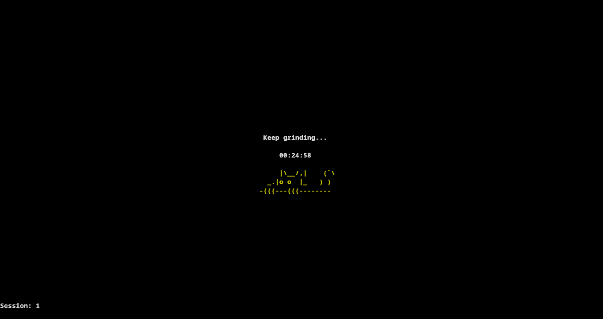

# pomoC
  a CLI pomodoro Timer written in C.
<div style="display: flex; justify-content: space-between;">
  
   
</div>

## Freatures:
  - work/rest time configuration via program arguments.
  - customize the cat colors using ansi escape sequence.
  - Session Counter to show how productive you are ;).
  - ring Sound to notify the state switch from work to rest and vice versa.
  - bro litteraly it has a cat A CAT that u can change it color.
## Requirements:
  - C compiler.
  - applay.
## usage:
  - make the executable:
    ```
      $> make
    ```
  - run the executable:
     - example run 25 minutes for work and 5 minutes rest:
    ```
      $> ./pomodoro 25 5
    ```
